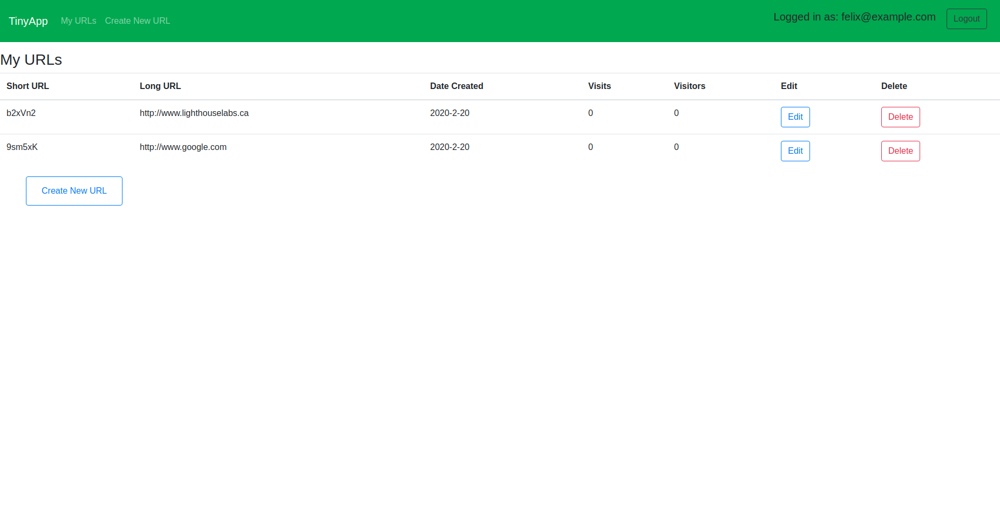
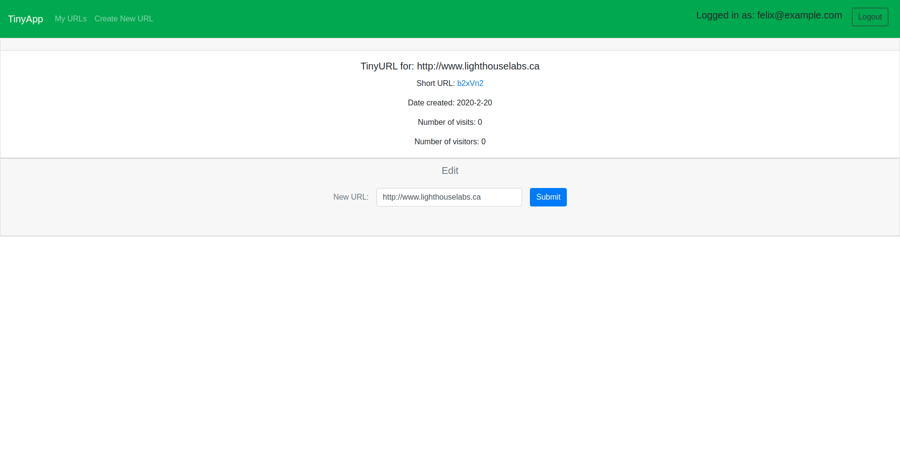
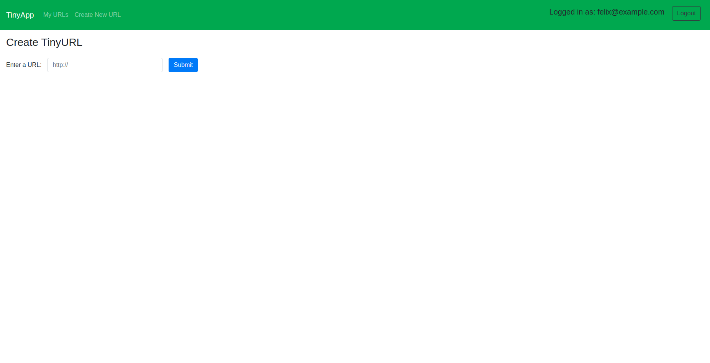
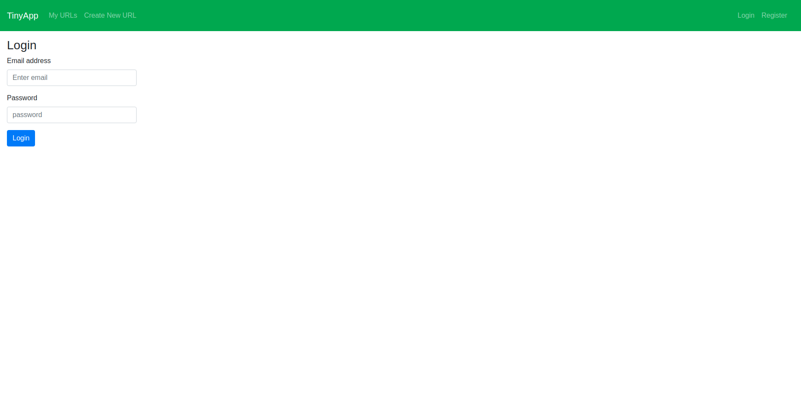
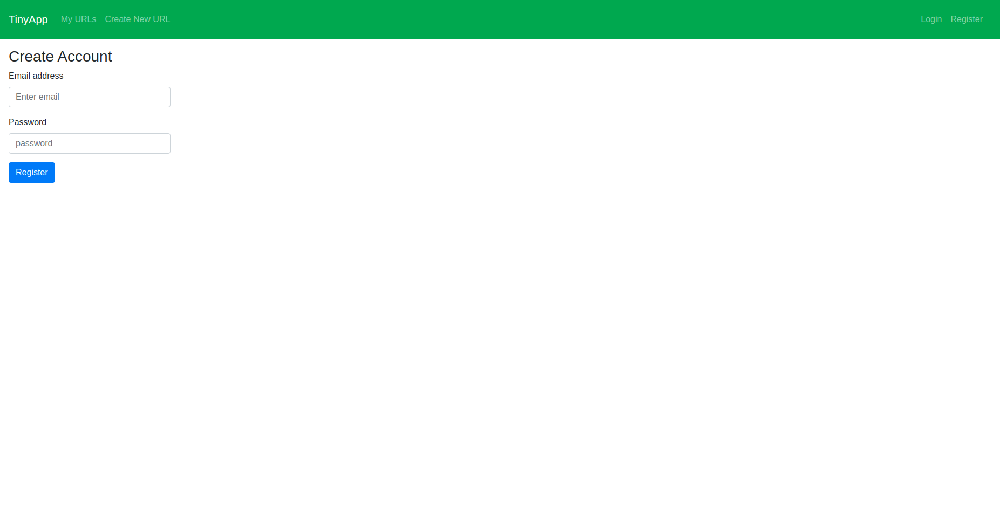

# TinyApp Project

TinyApp is a full stack web application built with Node and Express that allows users to shorten long URLs (à la bit.ly). The app generates a random string of character which it assigns to the url. When the shortened url is used, it will redirect to the long url. Additionally, the app provides some statistics about each URLs to the user. Namely, the creation date, the number of visits, and the number of unique visitors. URLs can only be edited or deleted by the user. Passwords are hashed with bcrypt and cookies are encrypted with cookie-session to ensure security for the user.

This app was made by Felix Rioux Sabourin in February 2020, on week 3 of [Lighthouse Labs](http://lighthouselabs.ca/)' 12 weeks web bootcamp. 

### User Stories

As an avid twitter poster,
I want to be able to shorten links
so that I can fit more non-link text in my tweets.

As a twitter reader,
I want to be able to visit sites via shortened links,
so that I can read interesting content.

As an avid twitter poster,
I want to be able to see how many times my subscribers visit my links
so that I can learn what content they like.

## Dependencies

- Node.js
- Express
- EJS
- bcrypt
- body-parser
- cookie-session
- method-override

## Getting Started

- Install all dependencies (using the `npm install` command).
- Run the development web server using the `node express_server.js` command.

## Final Product

The URLs page is where will be displayed the shortened URLs in a table. From there, each URL can be deleted, and the user can access edit the URL via the edit button.

Each URL has its dedicated page through which the user can view the statistics, and edit the long URL.

A new short URL can be generated via the URL creation page.

Users can login via the login page with their email and password.

Users can register via the registration page with their email and a new password.
